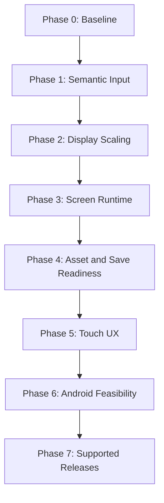

# Mobile And Multi-Platform Roadmap

Status: `In Progress — Phase 1 semantic-input foundation`

This document defines the eventual path from the current desktop Pygame game to
a supported desktop-and-Android release. It deliberately begins with frontend
work that improves the existing game even if Android support is never shipped.
It does not promote mobile work above the current gameplay stabilization and
manual-playtest priorities in [`DEVELOPMENT_ROADMAP.md`](DEVELOPMENT_ROADMAP.md).

## Outcome And Scope

The target is a landscape Android version that preserves the existing game
rules, content, and local-save contract while remaining a first-class desktop
release. Desktop Pygame remains supported throughout. Android is the first
mobile target; iOS, browser/WebAssembly, and a separate engine frontend are not
part of this roadmap.

The target experience must provide:

- a readable, touch-first landscape UI on typical Android phones and tablets;
- the same core gameplay, content definitions, and versioned saves as desktop;
- keyboard, mouse, and controller support on desktop without regressions;
- durable local saves that survive Android pause, background, and resume;
- reproducible signed Android builds and a tested desktop distribution path.

The project must not create a second gameplay engine, move Pygame behavior into
`src/core/`, or fork content rules by platform. Platform adaptation belongs at
the presentation, input, resource, and distribution boundaries.

## Current Constraints

The current architecture is a strong starting point: `src/core/` is independent
of Pygame and owns the game rules, persistence, content, and combat state. The
supported frontend is Pygame under `src/ui_pygame/`.

The frontend is not yet mobile-ready. It currently assumes a 1024x768 desktop
surface, has keyboard-first flows, and contains nested screen/modal loops that
poll Pygame events directly. Mouse support is broad but is not equivalent to a
complete touch UX. The runtime asset set is also large enough that Android
package size, load time, and bitmap memory need explicit ownership.

These are presentation and delivery problems, not a reason to rewrite core
gameplay. They should be addressed in bounded layers, with each layer retaining
desktop value and passing its own evidence gate before the next begins.

## Principles And Guardrails

1. **Preserve one core.** `src/core/` remains free of Pygame, Android, and
   frontend-specific target-legality rules. The existing action and event
   contracts remain the source of gameplay truth.
2. **Share semantics, not raw events.** Keyboard keys, mouse clicks, controller
   buttons, and touch gestures must map into named presentation commands rather
   than being interpreted independently by every screen.
3. **Use a logical canvas.** Screens render in a named logical coordinate space
   and are scaled/letterboxed by a single display boundary. No screen may own
   ad-hoc device-pixel conversion.
4. **Keep migration incremental.** Do not convert every UI screen at once.
   Replace one reusable screen family or modal primitive at a time behind
   preserved behavior and focused tests.
5. **Landscape first.** The first Android target is landscape phone and tablet.
   Portrait, foldables, split screen, and iOS remain explicitly deferred.
6. **No packaging commitment before evidence.** The Android feasibility phase
   may validate Pygame-CE with python-for-android/Buildozer, but a production
   toolchain is selected only after it builds, runs, saves, resumes, and is
   maintainable in CI.
7. **Do not delay current gameplay work.** A phase is promoted only when the
   roadmap priority permits it; this document does not authorize incidental
   mobile changes inside combat tuning, story, or content work.

## Dependency Order

Phases 0 through 4 are desktop-maintenance investments. Phase 5 creates a
mobile-quality interaction layer but remains runnable on desktop. Phase 6 is a
bounded go/no-go experiment. Only Phase 7 commits the project to ongoing Android
support.

## Phase 0 — Baseline And Ownership

State: `Deferred`

Purpose: establish an evidence-backed baseline before presentation behavior is
changed.

Deliverables:

- Inventory the current event-loop owners, modal primitives, hard-coded
  geometry, direct keyboard checks, mouse helpers, and save-write locations.
- Record the supported desktop resolutions and one or more representative
  landscape Android device profiles for regression testing.
- Add a platform-support matrix covering desktop Linux, Android ARM64, input
  methods, save behavior, audio behavior, and required manual checks.
- Record runtime asset size by category and identify source-only assets that do
  not belong in a shipped build.
- Establish a representative smoke route: launch, create or load a character,
  navigate town and dungeon, enter combat, save, quit, and reload.

Exit gate:

- The inventory names the first migration owners and identifies no hidden
  `src/core/` dependency on Pygame.
- The representative route has focused automated coverage where practical and
  a concise manual checklist where rendering/input must be observed.

## Phase 1 — Semantic Input Boundary

State: `In Progress — dungeon command boundary`

Purpose: replace duplicated raw-device handling with shared, screen-appropriate
commands. This improves desktop keyboard/controller consistency immediately and
prevents mobile controls from becoming a parallel rule system.

Scope:

- Define a small presentation-owned command vocabulary, such as navigation,
  confirm, cancel, inspect, interact, map, menu, page, and contextual combat
  actions.
- Introduce a single input adapter that turns Pygame keyboard, mouse, and
  controller events into commands plus logical pointer data.
- Migrate shared menu, popup, and combat-selection primitives first; retain
  temporary adapters for unmigrated screens.
- Centralize fresh-input/release guards so touch, mouse, and controller input
  cannot accidentally dismiss newly opened acknowledgement screens.
- Preserve each screen's existing shortcuts and controller parity where those
  controls already exist.

Current implementation:

- `src/ui_common.input.UiCommand` owns the initial vocabulary for common
  navigation plus dungeon actions.
- `src.ui_pygame.input_adapter` maps current dungeon keyboard shortcuts to
  those commands.
- `DungeonManager.handle_command()` is the device-neutral dispatch point for
  dungeon movement, turns, interaction, stairs, map/menu, paging, and the
  existing debug shortcut.
- Touch controls, pointer normalization, controller mappings, and migration of
  shared menus, popups, and combat selection remain future Phase 1 slices.

Out of scope:

- No virtual touch controls yet.
- No change to `BattleEngine`, action legality, target resolution, or save
  serialization.

Exit gate:

- The migrated primitives have unit tests for keyboard, pointer, and controller
  command translation.
- The desktop smoke route behaves identically using keyboard and mouse.
- New frontend code does not directly map raw keys to gameplay decisions outside
  the input adapter or an explicitly documented compatibility boundary.

## Phase 2 — Logical Canvas And Adaptive Layout

State: `Deferred`

Purpose: make the desktop UI robust at different window sizes and establish the
coordinate model required by Android.

Scope:

- Define canonical logical canvas dimensions and one centralized display scaler.
- Support fit/letterbox behavior, logical-to-physical pointer conversion, and
  safe-area insets without stretching game art.
- Make font sizes, row heights, panels, and hit targets derive from the logical
  layout rather than from one-off physical-pixel constants.
- Convert reusable popup, menu, combat, dungeon HUD, and Character Menu layout
  primitives before individual specialty screens.
- Add supported smaller desktop resolutions to manual and screenshot checks.

Expected desktop value:

- Resizable-window support and clearer layout ownership.
- Better controller/couch-play presentation on televisions or handheld PCs.
- Fewer regressions when menus gain rows, icons, or text.

Exit gate:

- The smoke route remains legible and clickable at every supported desktop
  resolution.
- Hit testing uses logical coordinates after scaling.
- No migrated screen depends on its caller having a 1024x768 physical display.

## Phase 3 — Screen Runtime And Modal Migration

State: `Deferred`

Purpose: replace nested event loops with an explicit screen stack and a single
top-level frame/update loop. This reduces input bugs on desktop and makes pause,
resume, and future browser/mobile lifecycle work tractable.

Scope:

- Define a presentation `Screen`/state contract with enter, handle-command,
  update, render, and exit responsibilities.
- Add stack operations for push, replace, return, and acknowledgement modal
  behavior.
- Route Pygame event collection through one top-level loop, then migrate shared
  popups and menu families incrementally.
- Preserve blocking call adapters only while a caller is being migrated; remove
  each adapter once its owning flow uses the stack directly.
- Keep frame timing, animation, combat outcome sequencing, and event-bus
  subscriptions behaviorally equivalent.

Risks to control:

- Avoid broad rewrites of combat or dungeon behavior under the guise of UI
  cleanup.
- Preserve fresh-input guards and return values for existing callers until their
  migration is complete.
- Test state transitions, especially save/load, combat entry/outcome, level up,
  story cards, and quit behavior.

Exit gate:

- The representative route uses one event-poll owner and an explicit state
  stack for its migrated screens.
- Nested loops are materially reduced and remaining ones are inventoried with a
  removal owner.
- Focused regression tests cover stack navigation and at least the primary
  combat, dungeon, menu, and save transitions.

## Phase 4 — Resource, Save, And Distribution Readiness

State: `Deferred`

Purpose: make runtime resources and persistence reliable outside the current
desktop PyInstaller model.

Scope:

- Keep [`src.paths`](../src/paths.py) as the sole resource and writable-data
  authority; extend it through tested platform adapters rather than scattered
  Android checks.
- Define an explicit save checkpoint policy: safe foreground transitions,
  return-to-menu, and Android pause/background must not leave a partial save.
- Separate production runtime assets from source atlases, review sheets, and
  generation inputs.
- Establish asset budgets for compressed package size, first-load time, and
  bitmap/audio memory. Convert or recompress oversized audio and art only with
  perceptual review.
- Keep the current desktop PyInstaller build reproducible while introducing a
  platform-neutral release manifest and smoke-test contract.

Exit gate:

- Resource and writable-data tests pass for checkout, frozen desktop, and a
  mocked mobile platform path.
- Interrupted saves remain atomic and versioned-save behavior is unchanged.
- The runtime asset manifest is explicit, reviewable, and does not include
  source-only files.
- Desktop distribution smoke tests continue to pass.

## Phase 5 — Touch-First Presentation Layer

State: `Deferred`

Purpose: implement Android-quality interaction while retaining the same Pygame
frontend on desktop. This phase must be usable with a mouse before an APK
exists.

Scope:

- Add touch event normalization to the Phase 1 input boundary, including tap,
  press/release, drag, long-press only where it materially improves inspection,
  and safe scrolling.
- Provide contextual on-screen controls: movement/turn/interact in dungeon
  navigation; visible confirm/back and target controls in combat; direct taps
  for menus and inventory.
- Use the side space created by a centered landscape logical canvas for mobile
  controls rather than shrinking core gameplay panels beyond readability.
- Ensure all primary actions are reachable with one hand where practical and
  use touch targets appropriate for a phone, not desktop button dimensions.
- Add an on-screen menu/back affordance rather than relying on a hardware
  keyboard or Android system Back behavior alone.
- Review character naming and other text-entry flows with the Android soft
  keyboard in mind.

Non-goals:

- Do not require portrait orientation.
- Do not reproduce hover-only information architecture; touch must have an
  explicit inspection path.
- Do not replace desktop mouse/keyboard UI with oversized mobile controls when
  a pointer-capable layout is clearer.

Exit gate:

- The full representative route can be completed using touch simulation or a
  touch-capable desktop device without a keyboard.
- Dungeon navigation, all combat action/target selection, scrolling, modal
  acknowledgement, menus, and text entry have explicit touch behavior.
- Manual readability review passes on at least one phone-class and one
  tablet-class logical profile.

## Phase 6 — Android Feasibility Spike

State: `Spec Gate`

Purpose: prove the selected packaging route before the project promises Android
support. This is a time-boxed experiment, not a production release.

Candidate route:

- Evaluate Pygame-CE with python-for-android/Buildozer and an SDL2-based
  Android bootstrap, pinned to reproducible versions. The existing `pygame`
  imports may remain compatible with Pygame-CE, but desktop parity must be
  verified before any dependency replacement is accepted.

Required spike outcomes:

1. Build an ARM64 debug APK from a clean Linux environment.
2. Install it on a physical Android phone.
3. Complete the representative route with real touch input.
4. Create, reload, and safely preserve a local save across background/resume.
5. Verify orientation lock, audio startup/fallback, soft keyboard, resource
   loading, and graceful low-memory behavior.
6. Record build duration, output size, runtime memory observations, known
   patches, and reproducibility steps.

Decision gate:

- **Promote Pygame Android support** only if the toolchain can be pinned,
  rebuilt from scratch, and exercised on real hardware without maintaining an
  unbounded fork of its native dependencies.
- **Pause Android delivery** if the package path requires recurring upstream
  patching, breaks core dependencies, or produces unacceptable stability or
  memory behavior. Retain Phases 1–5 because they still improve desktop.
- **Consider a separate mobile frontend** only through a new approved proposal
  that preserves `src/core/` and explicitly budgets the presentation rewrite.

## Phase 7 — Supported Desktop And Android Releases

State: `Deferred — Requires Phase 6 Promotion`

Purpose: turn a successful prototype into a maintainable released product.

Scope:

- Add a pinned Android build configuration, release manifest, signing process,
  version-code policy, and secret-free local build instructions.
- Add CI jobs for linting/package validation plus a manual or release-triggered
  signed Android build. Keep expensive artifact generation off ordinary source
  pushes unless a later CI policy changes that decision.
- Maintain a device matrix covering at least one current Android phone, one
  small/older phone profile, one tablet, and the supported desktop target.
- Add release smoke and manual certification checklists for install, upgrade,
  save compatibility, offline play, background/resume, audio, and touch.
- Decide distribution separately: internal testing/sideloading first, then a
  signed Android App Bundle and store requirements only when public release is
  approved.
- Define support policy for bug triage: gameplay rules remain shared; platform
  regressions receive frontend/distribution ownership and reproduction steps.

Exit gate:

- Desktop and Android artifacts are reproducible from documented pinned inputs.
- A versioned-save compatibility test demonstrates desktop-to-Android and
  Android-to-desktop transfer only if that transfer is explicitly supported;
  otherwise the UI clearly communicates platform-local saves.
- The release candidate completes the device matrix without blocker defects.
- The Android release path has an owner for SDK/toolchain updates and signing.

## Future Decisions Explicitly Deferred

The following require a separate proposal after Android support is stable:

- iOS or iPadOS support.
- Browser/WebAssembly distribution.
- Portrait mode, foldable-specific layouts, and split-screen support.
- Cloud saves, accounts, cross-device synchronization, achievements, or
  telemetry.
- A new Godot, Kivy, Flutter, native Android, or other non-Pygame frontend.
- Store monetization, purchases, ads, online services, or platform-specific
  social features.

## Validation Matrix

Every promoted phase must state which rows it changes and run focused evidence.

| Area | Desktop keyboard/mouse | Desktop controller | Android touch | Required evidence |
| --- | --- | --- | --- | --- |
| Menu and modal navigation | Required | Required where supported | Required after Phase 5 | Unit transitions plus manual route |
| Dungeon navigation | Required | Required where supported | Required after Phase 5 | Input and manual route |
| Combat action and target selection | Required | Required where supported | Required after Phase 5 | Focused combat regressions plus manual route |
| Character and inventory screens | Required | Preferred | Required after Phase 5 | Layout and touch inspection |
| Save/load and interruption | Required | N/A | Required after Phase 6 | Persistence regression and device test |
| Audio and lifecycle | Required | N/A | Required after Phase 6 | Manual device test and fallback coverage |
| Distribution | PyInstaller remains required | N/A | Required after Phase 7 | Clean-build smoke test |

## Relationship To Existing Documents

- [`ARCHITECTURE.md`](ARCHITECTURE.md) remains the authority for runtime
  boundaries, paths, saves, and current distribution behavior. Update it when
  a phase changes a shipped boundary.
- [`DEVELOPMENT_ROADMAP.md`](DEVELOPMENT_ROADMAP.md) owns when this work may be
  promoted. Update its state in the same change as any phase promotion or
  completion.
- [`PRESENTATION_ASSET_DESIGN_GATES.md`](PRESENTATION_ASSET_DESIGN_GATES.md)
  owns presentation and asset decisions; use it for concrete asset changes.
- [`SOUND_SYSTEM.md`](SOUND_SYSTEM.md) owns audio routing and fallback behavior.
- [`FOUNDATIONAL_REFACTOR_PLAN.md`](FOUNDATIONAL_REFACTOR_PLAN.md) remains the
  authority for combat action, targeting, timing, visibility, and save-boundary
  contracts. Mobile work must not reopen those decisions by inference.

When implementation begins, each pull request should name its phase, preserve
the current core/save contracts, update the applicable owner document, and
include the focused automated and manual validation it ran.
